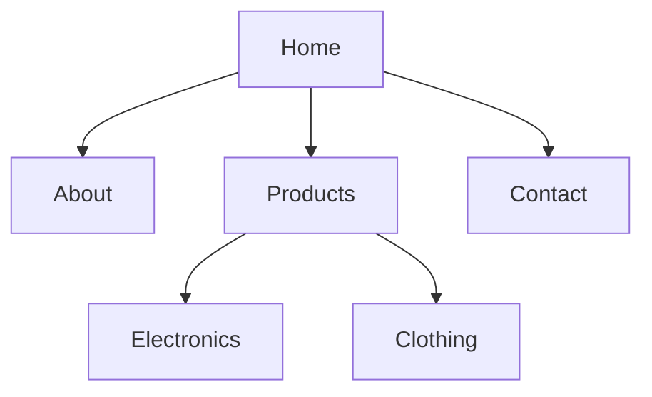

# Mermaid to Draw.io Sitemap Converter

A powerful Node.js tool that converts Mermaid flowchart/sitemap diagrams into professional Draw.io XML files with automatic styling and layout.

## Features

- **Automatic Layout**: Uses Dagre.js for clean, hierarchical layouts
- **Color-Coded Levels**: Nodes are colored based on their depth in the hierarchy
- **Professional Styling**: Rounded corners, shadows, bold fonts, and optimized spacing
- **Mermaid Syntax Support**: Supports standard Mermaid graph TD/flowchart syntax
- **Draw.io Compatible**: Generated XML can be directly imported into Draw.io

## Installation

1. Clone or download the project files
2. Install dependencies:
   ```bash
   npm install
   ```

## Usage

```bash
node converter.js <inputFile> [-o outputFile]
```

### Arguments

- `inputFile`: Path to the Mermaid file (.mmd) containing your flowchart/sitemap
- `-o, --output`: Output file path (default: `output.drawio`)

### Examples

```bash
# Basic usage
node converter.js sitemap.mmd

# Specify output file
node converter.js ecommerce.mmd -o my-ecommerce-site.drawio
```

## Mermaid Syntax

Create your sitemap using Mermaid's graph TD syntax:



### Supported Elements

- **Nodes**: `A[Label]` or `A(Label)`
- **Edges**: `A --> B` or `A --- B`
- **Comments**: Lines starting with `graph`, `flowchart`, or empty lines are ignored

## Output Features

The generated Draw.io XML includes:

- **Color Palette**:
  - Level 0 (root): Blue (#dae8fc)
  - Level 1: Green (#d5e8d4)
  - Level 2: Orange (#ffe6cc)
  - Level 3+: Purple (#e1d5e7)

- **Styling**:
  - Rounded rectangles with shadows
  - Bold, 14pt fonts
  - Optimized node sizes (140x70px)
  - Clean edge connections

- **Layout**:
  - Top-to-bottom hierarchical layout
  - Automatic spacing and positioning
  - Orthogonal edge routing

## Sample Sitemaps

The project includes several example sitemaps:

- `sitemap.mmd` - Basic website structure
- `ecommerce.mmd` - E-commerce site with product categories
- `portfolio.mmd` - Portfolio website with projects
- `restaurant.mmd` - Restaurant site with menu sections
- `blog.mmd` - Blog/news site with categories
- `university.mmd` - University website with academic sections

Each has a corresponding `.drawio` file for reference.

## Importing to Draw.io

1. Open Draw.io (diagrams.net)
2. File → Import → XML...
3. Select your generated `.drawio` file
4. The diagram will load with full styling and layout

## Dependencies

- `commander`: CLI argument parsing
- `dagre`: Graph layout algorithm
- `xmlbuilder2`: XML generation

## License

MIT License - feel free to use and modify as needed.

## Contributing

Feel free to submit issues or pull requests for improvements!
